<div align="center">


# JeevanSetu

### 🚑 AI-Assisted Clinical Triage, Referral & Hospital Routing — with a Doctor Always in the Loop

*A deterministic safety floor. A multi-agent AI co-pilot. A graph-scored route to the right hospital bed.*

<br/>

[](#-cicd)
[](#-overview)
[](#-deployment)
[](#-core-modules)
[](#-license)

<br/>


<br/><br/>

**[Live Demo](#-demo)** · **[Architecture](#-architecture)** · **[Quickstart](#-getting-started)** · **[API](#-api-documentation)** · **[Design Decisions](#-design-decisions)**

</div>

---

<div align="center">

### ⚡ The system in one picture

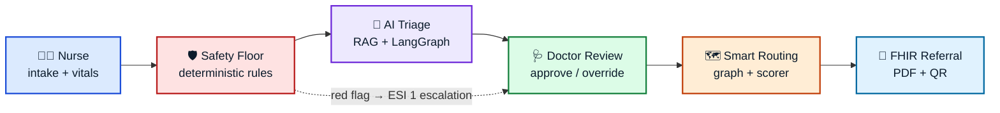

**No AI output reaches a patient without a doctor's signature.**

</div>

---

<details>
<summary><b>📑 Table of Contents</b> — click to expand</summary>

| | | |
|---|---|---|
| [Overview](#-overview) | [Problem Statement](#-problem-statement) | [Features](#-features) |
| [Demo](#-demo) | [Screenshots](#-screenshots) | [Architecture](#-architecture) |
| [Technology Stack](#-technology-stack) | [Project Structure](#-project-structure) | [Getting Started](#-getting-started) |
| [Configuration](#-configuration) | [API Documentation](#-api-documentation) | [Database Design](#-database-design) |
| [Core Modules](#-core-modules) | [Design Decisions](#-design-decisions) | [Challenges & Solutions](#-challenges--solutions) |
| [Trade-offs](#-trade-offs) | [Performance](#-performance-optimizations) | [Security](#-security) |
| [Scalability](#-scalability) | [Testing](#-testing) | [CI/CD](#-cicd) |
| [Deployment](#-deployment) | [Monitoring](#-monitoring--logging) | [Limitations](#-limitations) |
| [Future Improvements](#-future-improvements) | [Lessons Learned](#-lessons-learned) | [Contributing](#-contributing) |

</details>

---

# 🌍 Overview

**JeevanSetu** ("bridge of life") is an AI-assisted clinical triage, hospital routing, and referral system for emergency care networks. A frontline nurse captures vitals and symptoms; a deterministic safety engine screens for red flags; a RAG-backed multi-agent pipeline proposes a severity and ESI class with citations; a doctor approves, modifies, or overrides; only then does the system rank destination hospitals on live capacity and emit an HL7 FHIR referral.

> [!IMPORTANT]
> **Human-in-the-Loop by construction.** The system never makes an autonomous, final medical assessment. Routing, referral generation, and notifications are all gated behind a certified doctor's review.

<table>
<tr>
<th width="34%">👥 Who it's for</th>
<th width="33%">🔥 What it fixes</th>
<th width="33%">🧩 How it fixes it</th>
</tr>
<tr valign="top">
<td>

🧑‍⚕️ **Triage Nurses**<br/><sub>Fast intake, vitals, instant red-flag warnings</sub>

🩺 **Doctors**<br/><sub>Priority queue, guideline citations, one-click referral</sub>

🏥 **Hospital Admins**<br/><sub>Beds, ICU, departments, staffing</sub>

📊 **CMO / Health Authorities**<br/><sub>Regional analytics, transfer flow, capacity</sub>

🔐 **Super Admins**<br/><sub>Users, RBAC, audit trails</sub>

</td>
<td>

🚨 **ED overcrowding**<br/><sub>Trauma centres jam while community hospitals idle</sub>

🩻 **Routing failure**<br/><sub>Critical patients sent where the ventilator isn't</sub>

📚 **Guideline lookup lag**<br/><sub>WHO/ESI PDFs unusable under pressure</sub>

🎲 **AI hallucination risk**<br/><sub>Unbounded LLMs in a clinical loop</sub>

</td>
<td>

📐 **Live resource scorer**<br/><sub>5 weighted factors, severity-tuned</sub>

🛡️ **Deterministic gating**<br/><sub>Hard rules run *before* any LLM call</sub>

🔎 **RAG citations**<br/><sub>Exact snippet, section, and page number</sub>

✍️ **Doctor-in-the-Loop**<br/><sub>Downstream ops blocked until sign-off</sub>

</td>
</tr>
</table>

---

# 🎯 Problem Statement

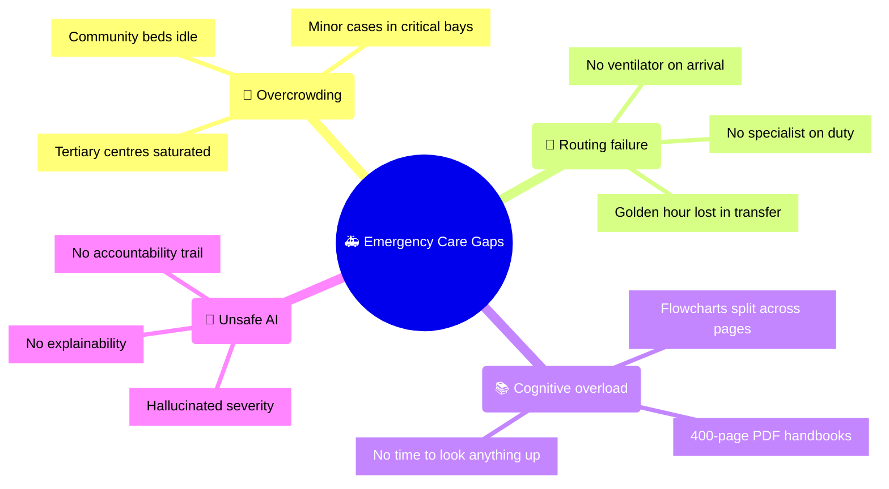

| ❌ Real-world problem | ✅ JeevanSetu's answer |
|---|---|
| Patients misallocated across the network | **Live resource scorer** ranks hospitals by distance, capacity, equipment, specialists, tier |
| Severe patients routed to under-equipped sites | **Neo4j graph filter** — only candidates that actually satisfy the resource requirement survive |
| Guidelines too slow to consult mid-triage | **Pinecone RAG** returns the exact snippet + page, inline in the triage screen |
| LLMs unsafe as autonomous clinical deciders | **`safety.engine.ts`** runs first and its floor is absolute; supervisor reconciles AI output against it |

---

# ✨ Features

<table>
<tr><td width="50%" valign="top">

### 🏥 Clinical

- 📝 **Patient intake** — vitals, symptoms, allergies, guardian, history
- 🛡️ **Deterministic safety engine** — pediatric, trauma, cardiac, respiratory, neuro red flags
- 🤖 **AI triage (LangGraph)** — severity + ESI class as strict structured JSON
- 📚 **Medical PDF RAG** — multimodal Python ingestion → Pinecone citations
- 🗺️ **Smart routing** — Neo4j candidate filter + 5-factor weighted scorer
- 📄 **FHIR R4 referrals** — bundle + printable PDF + verification QR
- 📊 **Live dashboards** — Socket.IO metrics, alerts, load, referral tracking
- 🔒 **Immutable audit log** — actor, IP, user-agent, old/new state, timestamp

</td><td width="50%" valign="top">

### ⚙️ Technical

- 🔐 **Clerk auth** — modern session management, MFA-ready
- 👮 **Granular RBAC** — Nurse · Doctor · Admin · CMO · Super Admin
- ⚡ **Redis** — cache, queues, and pub/sub event bus
- 🕸️ **7-agent pipeline** — Intake, Safety, Triage, RAG, Risk, Routing, Supervisor
- ☁️ **S3-compatible uploads** — local filesystem fallback for dev
- 📣 **Multi-channel alerts** — Resend email · Twilio SMS · in-app toasts
- 🧪 **Vitest** — unit coverage on the safety engine and routing scorer
- 🧰 **Graceful degradation** — every external dependency has a fallback path

</td></tr>
</table>

---

# 🎬 Demo

<div align="center">

| 🌐 Live App | 🎥 Walkthrough | 📘 API Docs |
|:---:|:---:|:---:|
| [](https://jeevansetu-staging.vercel.app) | [](https://jeevansetu-staging.vercel.app/docs/demo.mp4) | [](http://localhost:4000/api/v1/docs) |

</div>

---

# 🖼️ Screenshots

<table>
<tr>
<td width="50%" valign="top">

### 1️⃣ Nurse Intake
```
┌──────────────────────────────────────┐
│  🧑‍⚕️  NEW PATIENT INTAKE      Step 2/4 │
├──────────────────────────────────────┤
│  Name  ▸ Asha Kulkarni     Age ▸ 62   │
│  ────────────────────────────────────│
│  SpO₂    ▓▓▓▓▓▓▓░░░  87%   🔴 CRITICAL│
│  HR      ▓▓▓▓▓▓▓▓░░  128               │
│  BP      86 / 54           🟠 LOW      │
│  GCS     ▓▓▓░░░░░░░  8     🔴 CRITICAL│
│  ────────────────────────────────────│
│  🛡️ SAFETY SCREEN: 2 RED FLAGS         │
│     → auto-escalated to ESI 1          │
└──────────────────────────────────────┘
```
<sub>Vitals capture with live threshold feedback and an instant deterministic safety verdict.</sub>

</td>
<td width="50%" valign="top">

### 2️⃣ Doctor Review + RAG Citations
```
┌──────────────────────────────────────┐
│  🩺 REVIEW QUEUE            3 waiting │
├──────────────────────────────────────┤
│  AI SEVERITY  ▸ CRITICAL   ESI 1      │
│  CONFIDENCE   ▓▓▓▓▓▓▓▓▓░  0.91        │
│  ────────────────────────────────────│
│  📚 CITATIONS                          │
│   • ESI Handbook  p.42  §3.1  ▓▓▓ .88 │
│   • WHO ETAT      p.17  §2.4  ▓▓░ .74 │
│  ────────────────────────────────────│
│  [ ✅ APPROVE ] [ ✏️ MODIFY ] [ ⛔ OVERRIDE ]│
└──────────────────────────────────────┘
```
<sub>Every AI claim carries a source, section, page, and similarity score before a doctor signs.</sub>

</td>
</tr>
<tr>
<td width="50%" valign="top">

### 3️⃣ Routing & Scoring
```
┌──────────────────────────────────────┐
│  🗺️ RECOMMENDED DESTINATIONS          │
├──────────────────────────────────────┤
│ 🥇 City Trauma Ctr    score ▓▓▓▓▓ .91 │
│    6.2 km · 14 ICU · 🫁 vent · 🫀 cath│
│ 🥈 St. Mary General   score ▓▓▓░░ .67 │
│    3.1 km · 2 ICU  · 🫁 vent          │
│ 🥉 Rural CHC          score ▓▓░░░ .38 │
│    1.8 km · 0 ICU  · no specialist    │
│  ────────────────────────────────────│
│  "Nearest is not best: CHC lacks ICU" │
└──────────────────────────────────────┘
```
<sub>Ranked candidates with a human-readable reason for the ordering.</sub>

</td>
<td width="50%" valign="top">

### 4️⃣ CMO Regional Analytics
```
┌──────────────────────────────────────┐
│  📊 REGIONAL COMMAND         ● LIVE   │
├──────────────────────────────────────┤
│  ESI 1 ▓▓░░░░░░░░  12   Transfers  47 │
│  ESI 2 ▓▓▓▓░░░░░░  31   Avg triage 42s│
│  ESI 3 ▓▓▓▓▓▓▓░░░  88   Overrides  6% │
│  ────────────────────────────────────│
│  BED LOAD   City ██████████ 96% 🔴    │
│             Mary ██████░░░░ 61% 🟡    │
│             CHC  ██░░░░░░░░ 18% 🟢    │
└──────────────────────────────────────┘
```
<sub>Socket.IO-driven regional heatmap, transfer flow, and triage accuracy trends.</sub>

</td>
</tr>
</table>

---

# 🏛️ Architecture

## System Architecture

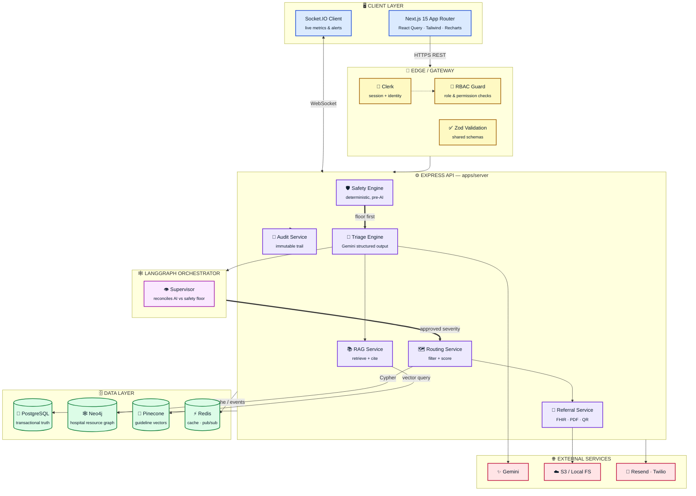

<details>
<summary><b>🔄 Request Flow — a triage call, end to end</b></summary>

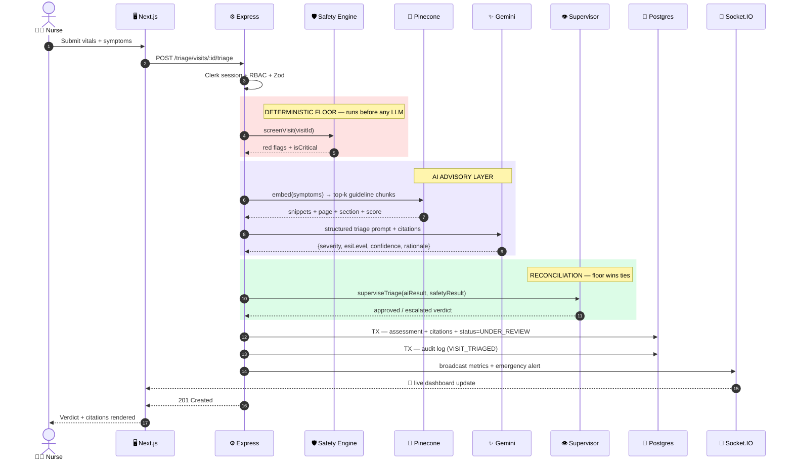

</details>

<details>
<summary><b>🔁 Visit Lifecycle — state machine</b></summary>

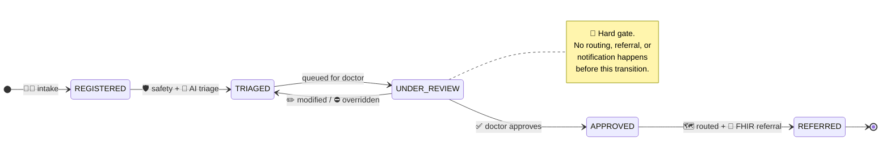

</details>

<details>
<summary><b>🧩 Monorepo component map</b></summary>

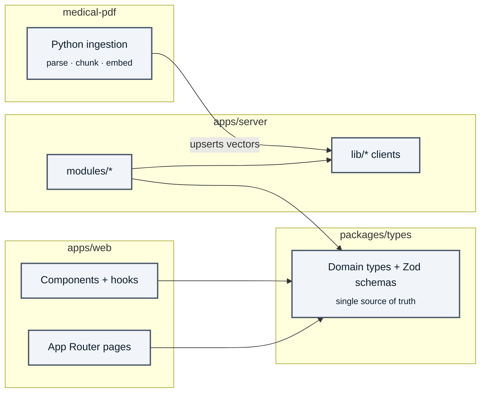

</details>

---

# 🧰 Technology Stack

<div align="center">

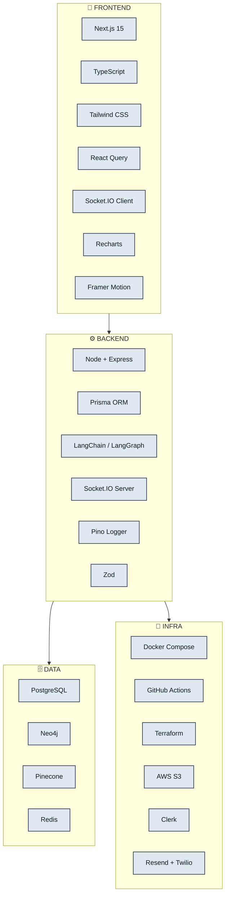

</div>

<table>
<tr><td width="50%" valign="top">

**🎨 Frontend**

| Tech | Purpose |
|---|---|
| **Next.js 15** | App Router, Server Components |
| **TypeScript** | Type-safe end to end |
| **Tailwind CSS** | Styling and layout |
| **React Query** | Server-state sync |
| **Socket.IO Client** | Live dashboards |
| **Recharts** | Analytics charts |
| **Framer Motion** | Transitions |

</td><td width="50%" valign="top">

**⚙️ Backend**

| Tech | Purpose |
|---|---|
| **Node / Express** | API runtime + routing |
| **Prisma** | Postgres ORM + migrations |
| **LangChain / LangGraph** | Multi-agent orchestration |
| **Socket.IO** | Real-time broadcast |
| **Pino** | Structured logging |
| **Zod** | Runtime validation |

</td></tr>
<tr><td valign="top">

**🗄️ Data**

| Store | Role |
|---|---|
| 🐘 **PostgreSQL** | Users, patients, visits, reviews, audits |
| 🕸️ **Neo4j** | Hospital resources, departments, routing |
| 🌲 **Pinecone** | Guideline embeddings for RAG |
| ⚡ **Redis** | Cache, queues, pub/sub |

</td><td valign="top">

**🚀 Infrastructure**

| Tool | Role |
|---|---|
| 🐳 **Docker / Compose** | Local + containerised deploys |
| ☁️ **AWS S3** | Referral PDFs, guideline docs |
| 🔐 **Clerk** | Auth + RBAC provisioning |
| 📧 **Resend** | Transactional email |
| 📱 **Twilio** | Emergency SMS |
| 🤖 **GitHub Actions** | CI/CD |

</td></tr>
</table>

---

# 📁 Project Structure

```text
jeevansetu/
│
├── 📱 apps/
│   ├── server/                      # Express API
│   │   ├── prisma/                  # Schema · migrations · seeds
│   │   └── src/
│   │       ├── config/              # env validation, Pino logger
│   │       ├── lib/                 # ai · pinecone · prisma · storage clients
│   │       ├── middleware/          # auth · RBAC · validation · errors
│   │       ├── modules/             # ── domain features ──────────────
│   │       │   ├── 🛡️  safety/       #   deterministic red-flag engine
│   │       │   ├── 🤖 triage/       #   Gemini triage + prompts
│   │       │   ├── 🕸️  agents/       #   LangGraph orchestrator + supervisor
│   │       │   ├── 📚 rag/          #   chunking · pdf-extract · retrieval
│   │       │   ├── 🗺️  routing/      #   neo4j · geo · scorer
│   │       │   ├── 📄 referrals/    #   fhir · pdf · qr
│   │       │   ├── 🩺 review/       #   doctor queue + decisions
│   │       │   ├── 📊 dashboard/    #   live metrics
│   │       │   └── 📜 audit/        #   immutable trail
│   │       ├── realtime/            # Socket.IO server + events
│   │       └── app.ts               # Express bootstrap
│   │
│   └── web/                         # Next.js 15 client
│       └── src/
│           ├── app/(dashboard)/     # intake · review · hospitals · analytics
│           ├── components/          # StatCard · SeverityBadge · EmergencyToast
│           ├── context/             # Language provider
│           └── hooks/               # useEmergencySocket, API hooks
│
├── 📦 packages/
│   ├── types/                       # shared domain types + Zod schemas
│   ├── config/                      # ESLint + tsconfig presets
│   └── ui/                          # shared UI primitives
│
├── 🐍 medical-pdf/ingestion/        # PDF → chunks → embeddings → Pinecone
├── 🐳 docker/                       # Dockerfiles + compose
├── 🏗️  terraform/                    # cloud infrastructure
└── 📚 docs/                         # ARCHITECTURE.md · PHASES.md
```

---

# 🚀 Getting Started

### 📋 Prerequisites

<div align="center">


</div>

### ⚡ Five steps to a running stack

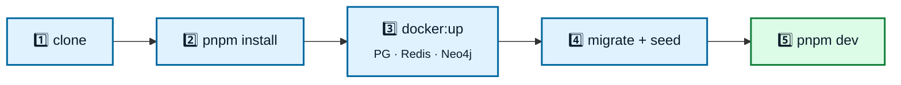

```bash
# 1 — clone
git clone https://github.com/your-repo/JeevanSetu.git && cd JeevanSetu

# 2 — install workspace deps
pnpm install

# 3 — boot local infra (Postgres, Redis, Neo4j)
pnpm docker:up

# 4 — prepare the database
pnpm db:generate && pnpm db:migrate && pnpm db:seed

# 5 — run everything
pnpm dev
```

<div align="center">

| Service | URL |
|---|---|
| 🖥️ Web | `http://localhost:3000` |
| ⚙️ API | `http://localhost:4000` |
| 🕸️ Neo4j Browser | `http://localhost:7474` |

</div>

---

# ⚙️ Configuration

```bash
cp .env.example .env
```

> [!TIP]
> Almost every external dependency is **optional in development** — the server degrades gracefully rather than failing to boot.

| Variable | Description | Required | Fallback behaviour |
|---|---|:---:|---|
| `DATABASE_URL` | PostgreSQL connection string | ✅ | — (hard requirement) |
| `REDIS_URL` | Redis server URL | ⬜ | In-process cache, no cross-instance pub/sub |
| `GEMINI_API_KEY` | Google Gemini key | ⬜ | 🔁 Deterministic rule-based assessor |
| `PINECONE_API_KEY` | Pinecone key | ⬜ | 🔁 RAG citations disabled |
| `NEO4J_URI` | Neo4j bolt endpoint | ⬜ | 🔁 Postgres candidate query |
| `CLERK_SECRET_KEY` | Clerk backend key | ⬜ | 🔁 Mock dev user, auth bypassed |

**Config files worth knowing:**

| File | Role |
|---|---|
| `pnpm-workspace.yaml` | Monorepo workspace wiring |
| `turbo.json` | Build/task caching graph |
| `prisma/schema.prisma` | Schema, indexes, extensions |
| `apps/server/src/config/env.ts` | Boot-time env validation |

---

# 🔌 API Documentation

<div align="center">

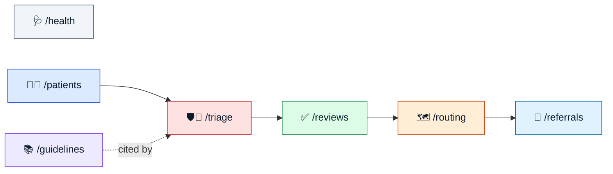

</div>

<details open>
<summary><b>🩺 Health & System</b></summary>

| Method | Endpoint | Description |
|:---:|---|---|
|  | `/health` | Liveness probe |
|  | `/health/ready` | Readiness — Postgres, Redis, Neo4j |

</details>

<details open>
<summary><b>🧑‍⚕️ Patients & Intake</b></summary>

| Method | Endpoint | Description |
|:---:|---|---|
|  | `/api/v1/patients/intake` | Register patient + open a visit |
|  | `/api/v1/patients/visits/:id/vitals` | Record vital signs |

</details>

<details open>
<summary><b>🛡️ Triage & Guidelines</b></summary>

| Method | Endpoint | Description |
|:---:|---|---|
|  | `/api/v1/triage/visits/:id/safety-screen` | Deterministic safety floor |
|  | `/api/v1/triage/visits/:id/triage` | Multi-agent AI triage |
|  | `/api/v1/guidelines` | List ingested guidelines |
|  | `/api/v1/guidelines/upload` | Ingest a new guideline PDF |

</details>

<details open>
<summary><b>✅ Review, Routing & Referrals</b></summary>

| Method | Endpoint | Description |
|:---:|---|---|
|  | `/api/v1/reviews/queue` | Cases awaiting doctor approval |
|  | `/api/v1/reviews/visits/:id/review` | Approve · modify · override |
|  | `/api/v1/routing` | Ranked hospital destinations |
|  | `/api/v1/referrals/visits/:id/generate` | FHIR bundle + PDF + QR |

</details>

---

# 🗃️ Database Design

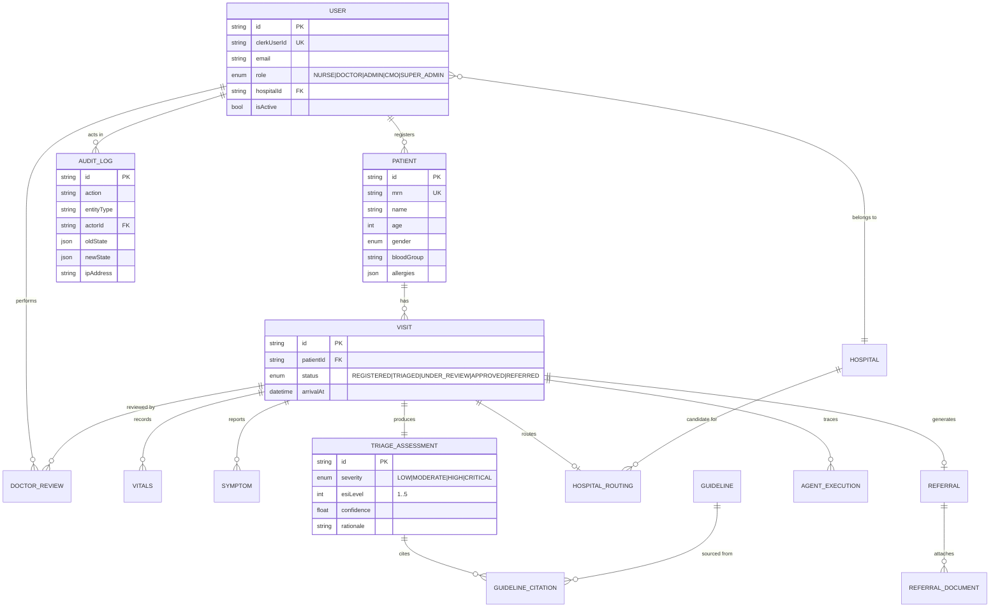

<details>
<summary><b>📋 Core table notes</b></summary>

| Table | Purpose | Key columns |
|---|---|---|
| **`users`** | Identity mirrored from Clerk, plus app role | `clerkUserId`, `role`, `hospitalId`, `isActive` |
| **`patients`** | Demographics + static clinical facts | `mrn`, `name`, `age`, `bloodGroup`, `allergies` |
| **`visits`** | One emergency check-in; the spine of the workflow | `status`, `arrivalAt`, `patientId` |
| **`triage_assessments`** | AI output + supervisor verdict | `severity`, `esiLevel`, `confidence`, `rationale` |
| **`audit_logs`** | Append-only history | `action`, `oldState`, `newState`, `ipAddress`, `userAgent` |

</details>

---

# 🧠 Core Modules

## 🛡️ 1. Safety Layer — `modules/safety`

Deterministic rules evaluated **before any model call**. If a rule fires, the case is escalated regardless of what the LLM later says.

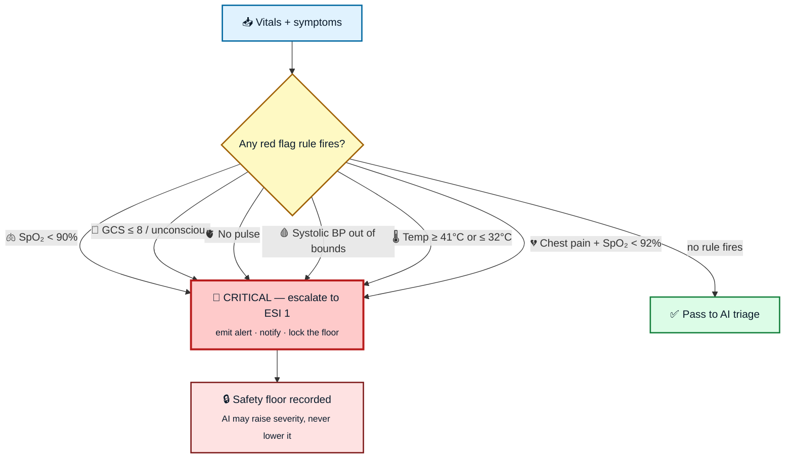

📄 `apps/server/src/modules/safety/safety.engine.ts` · rules carry a `rationale` and machine-readable `evidence` payload for the audit trail.

---

## 🤖 2. AI Triage Engine — `modules/triage`

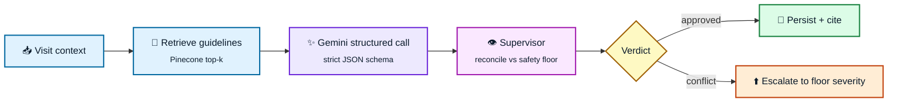

📄 `triage.engine.ts` · `triage.prompts.ts` · `agents/supervisor.ts`

---

## 🗺️ 3. Hospital Routing — `modules/routing`

Two stages: a **graph filter** that removes hospitals which cannot serve the case, then a **pure, deterministic scorer** over five normalised `[0,1]` factors.

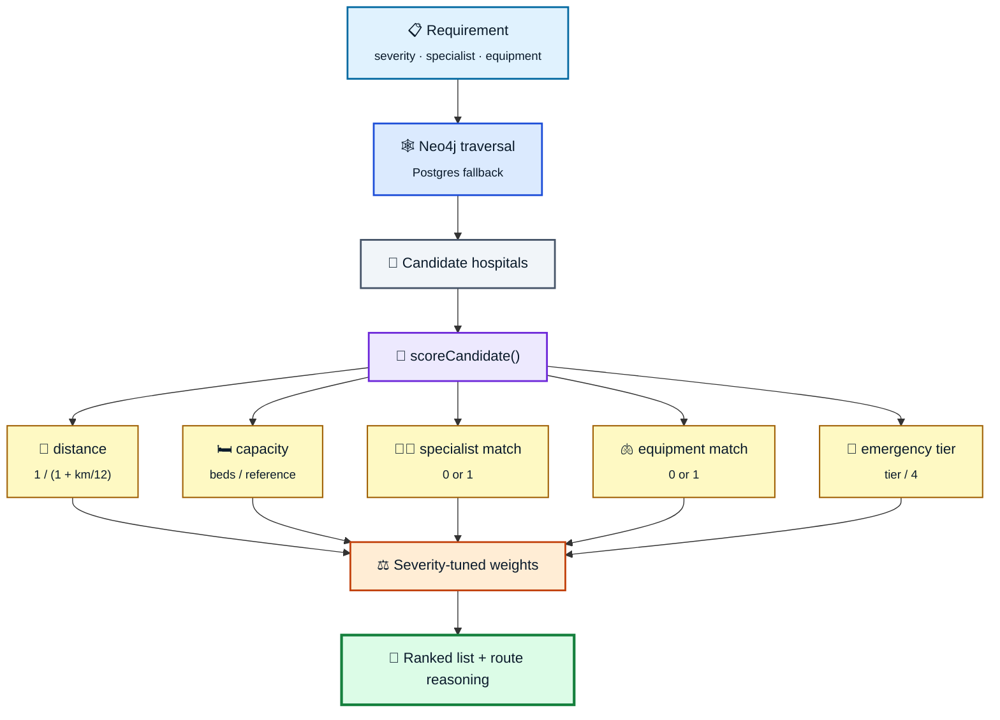

### ⚖️ Weights shift with severity

For **CRITICAL** cases, proximity and emergency capability dominate — the golden hour beats a perfect specialist match:

<table>
<tr><td width="50%">

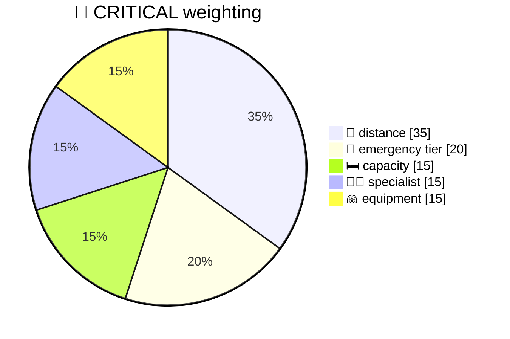

</td><td width="50%">

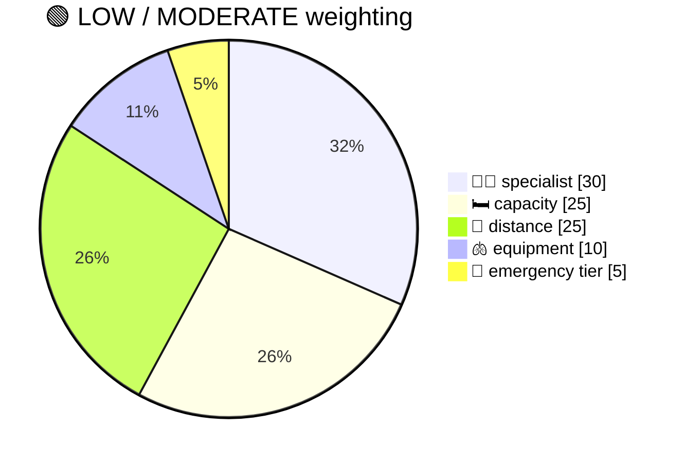

</td></tr>
</table>

| Severity | 📍 distance | 🛏️ capacity | 👨‍⚕️ specialist | 🫁 equipment | 🚨 tier |
|---|:---:|:---:|:---:|:---:|:---:|
| 🔴 **CRITICAL** | **0.35** | 0.15 | 0.15 | 0.15 | **0.20** |
| 🟠 **HIGH** | 0.30 | 0.20 | **0.25** | 0.15 | 0.10 |
| 🟢 **LOW / MODERATE** | 0.25 | 0.25 | **0.30** | 0.10 | 0.05 |

📄 `routing.scorer.ts` (pure + unit-tested) · `neo4j.ts` · `geo.ts`

---

## 📄 4. Referrals — `modules/referrals`

```mermaid
flowchart LR
    A["✅ Approved visit"]:::in --> B["🧬 FHIR R4 bundle"]:::f
    B --> C["📄 PDF render"]:::f
    C --> D["🔗 Verification QR"]:::f
    D --> E["☁️ S3 / local storage"]:::st
    E --> F["📣 Email + SMS + toast"]:::n
    classDef in fill:#dcfce7,stroke:#15803d,stroke-width:2px,color:#0b1b2b
    classDef f fill:#e0f2fe,stroke:#0369a1,stroke-width:2px,color:#0b1b2b
    classDef st fill:#f1f5f9,stroke:#475569,stroke-width:2px,color:#0b1b2b
    classDef n fill:#ffe4e6,stroke:#be123c,stroke-width:2px,color:#0b1b2b
```

---

# 🧭 Design Decisions

<table>
<tr><th width="26%">Decision</th><th width="37%">Why</th><th width="37%">Consequence</th></tr>
<tr valign="top">
<td>🛡️ <b>Deterministic safety gating</b></td>
<td>LLMs cannot guarantee bounds on life-critical thresholds.</td>
<td>Hard-coded TS rules run <i>before</i> the model. AI is advisory; the floor is absolute.</td>
</tr>
<tr valign="top">
<td>🕸️ <b>Neo4j for routing</b></td>
<td>"Cardiologist + ICU bed + ventilator, within range" is a graph question, not a join.</td>
<td>Candidate filtering stays fast as the resource model grows; Postgres remains the fallback.</td>
</tr>
<tr valign="top">
<td>🧾 <b>Zod in <code>packages/types</code></b></td>
<td>Form validation and API validation drifting apart is a class of bug, not one bug.</td>
<td>One schema, imported by both apps. Change it once.</td>
</tr>
<tr valign="top">
<td>🧮 <b>Pure scorer function</b></td>
<td>Ranking logic must be explainable and testable in isolation.</td>
<td><code>scoreCandidate()</code> has no I/O — unit tests cover the weighting directly.</td>
</tr>
</table>

---

# 🧗 Challenges & Solutions

<details open>
<summary><b>⚠️ Challenge — External model quotas and availability</b></summary>

**Problem:** missing API keys or Gemini free-tier rate limits stalled local development and CI.

**Solution:** feature-flagged resilience. Missing key or failed call → the server degrades to a local rule-based assessor and labels the output `[DETERMINISTIC FALLBACK]`, so nobody mistakes it for a model verdict.

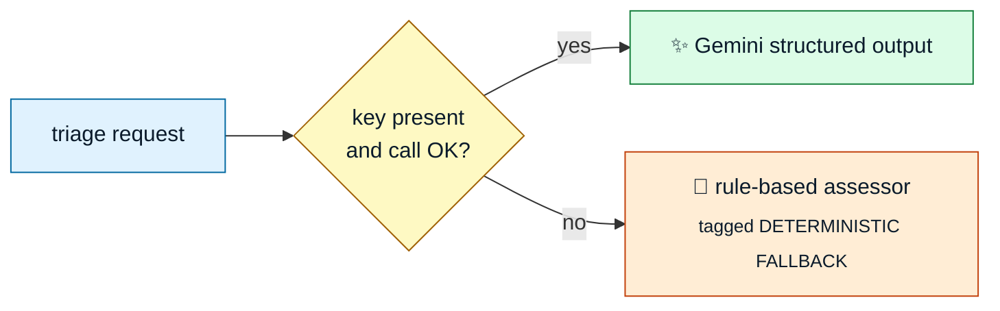

</details>

<details open>
<summary><b>⚠️ Challenge — RAG retrieval accuracy on clinical PDFs</b></summary>

**Problem:** naive text chunking cut flowcharts and triage tables in half across page boundaries, producing citations that were technically relevant and clinically useless.

**Solution:** a hybrid Python pipeline that extracts tables structurally and converts flowchart images via Gemini Vision, storing each as an **atomic, undivided chunk**.

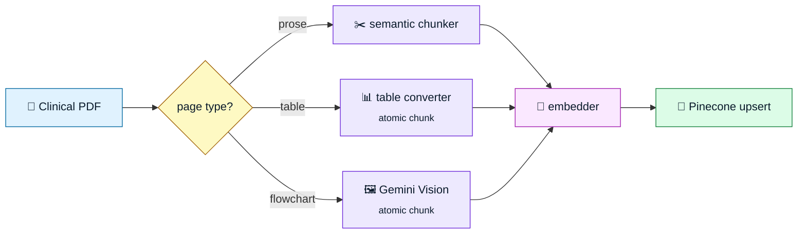

</details>

---

# ⚖️ Trade-offs

### 🔐 Clerk (managed auth) vs self-hosted JWT

| | |
|---|---|
| **Chosen** | ✅ Clerk |
| **Pros** | Instant integration · built-in MFA · session logging · RBAC role management out of the box |
| **Cons** | External network dependency · subscription pricing ceiling |
| **Mitigation** | Bypassed in dev via a local mock user, so development never blocks on a third party |

---

# ⚡ Performance Optimizations

| | Optimization | Effect |
|:---:|---|---|
| 🗄️ | **Redis query caching** on hospital bed capacity with write-through invalidation | Removes the hottest read from the routing path |
| 🪆 | **Matryoshka embedding truncation** — 3072 → 1024 dimensions before indexing | Smaller payloads, lower Pinecone query latency |
| 📦 | **Prisma transaction batching** for record + audit writes | Fewer round trips, no connection-pool exhaustion |
| 🧮 | **Pure scorer, zero I/O** | Ranking cost is CPU-only and trivially parallelisable |

---

# 🔒 Security

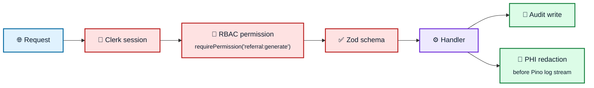

- 🧹 **PHI redaction** — middleware scrubs health records and credentials from log streams.
- 👮 **Granular RBAC** — permission checks at the gateway, not scattered through handlers.
- 📜 **Immutable audit** — every review action recorded with actor, IP, user-agent, and full state delta.

---

# 📈 Scalability

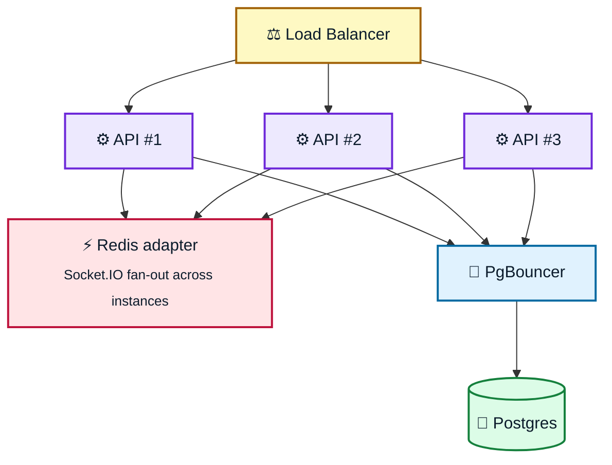

- **Stateless API** — no in-process session state, so instances scale horizontally behind a load balancer.
- **Redis Socket.IO adapter** — real-time broadcasts reach clients on every instance.
- **PgBouncer pooling** — absorbs connection spikes without exhausting Postgres.

---

# 🧪 Testing

```bash
pnpm test          # Vitest unit suites
```

| Suite | Covers |
|---|---|
| `safety.engine.test.ts` | Vital-threshold rules, red-flag evidence payloads |
| `routing.scorer.test.ts` | Factor normalisation, severity weighting, ranking order |

**Manual smoke checks**

- 🔴 Register a patient with SpO₂ `< 89%` → expect immediate emergency broadcast and ESI 1.
- ✏️ Record a doctor override with justification → expect a matching `audit_logs` row with old/new state.

---

# 🔄 CI/CD

```mermaid
flowchart LR
    A["📤 Push / PR"]:::i --> B["🧹 ESLint + Prettier"]:::c
    B --> C["🧪 Vitest"]:::c
    C --> D["🏗️ Build server + web images"]:::b
    D --> E["📦 Push to registry"]:::b
    E --> F["🚀 Railway API"]:::d
    E --> G["🚀 Vercel Web"]:::d
    classDef i fill:#e0f2fe,stroke:#0369a1,stroke-width:2px,color:#0b1b2b
    classDef c fill:#fef9c3,stroke:#a16207,stroke-width:2px,color:#0b1b2b
    classDef b fill:#ede9fe,stroke:#6d28d9,stroke-width:2px,color:#0b1b2b
    classDef d fill:#dcfce7,stroke:#15803d,stroke-width:2px,color:#0b1b2b
```

---

# 🚢 Deployment

<div align="center">

| Component | Platform | Notes |
|---|---|---|
| 🖥️ **Web frontend** |  | Next.js edge/serverless runtime |
| ⚙️ **Backend API** |  | Docker container |
| 🐘 **PostgreSQL** | Railway addon | Primary transactional store |
| ⚡ **Redis** | Railway addon | Cache + pub/sub |
| 🕸️ **Neo4j** | Neo4j Aura | Managed graph |
| 🌲 **Pinecone** | Managed | Guideline vectors |

</div>

---

# 📡 Monitoring & Logging

| | Tool | What it gives you |
|:---:|---|---|
| 🐛 | **Sentry** | Crash reports and backend runtime failures |
| 📝 | **Pino HTTP** | Structured JSON access logs with PHI redaction |
| ❤️ | **`/health/ready`** | Postgres · Redis · Neo4j status for cloud probes |
| 🧾 | **GenAI logger** | Per-call model usage, latency, and fallback reasons |

---

# 🚧 Limitations

> [!WARNING]
> - **Multimodal ingestion** depends on Gemini APIs and can throttle under high volume.
> - **Local fallbacks** do not fully simulate high-concurrency Clerk token exchange.
> - **Routing** assumes Haversine distance with an estimated travel time — no live traffic feed yet.

---

# 🔮 Future Improvements

```mermaid
timeline
    title Roadmap
    Next : 🎙️ Voice triage intake (field STT)
         : 🌐 Full multilingual UI (Hindi, Marathi)
    Then : 🚑 Ambulance dispatch + live ETA
         : 🚦 Traffic-aware travel time
    Later : 📱 Offline-first mobile intake
          : 🔗 State HMIS / ABDM interoperability
```

---

# 🎓 Lessons Learned

> 💡 **Human-in-the-loop is not a compliance checkbox.** Framing AI output as *cited advice* rather than a decision is what made clinicians willing to use it at all.

> 💡 **Split the stores by question shape.** Transactional history belongs in Postgres; "which hospital can actually take this patient" is a graph traversal. Forcing one store to do both made both slower.

> 💡 **A deterministic floor beats a better prompt.** No amount of prompt engineering gives the guarantee that ten lines of threshold checks give for free.

---

# 🤝 Contributing

```bash
git checkout -b feature/your-feature-name   # 1. branch
# 2. commit using Conventional Commits — enforced by commitlint + husky
git push origin feature/your-feature-name   # 3. open a PR against main
```

All PRs must pass lint, format, and the Vitest suites.

---

# 📜 License

**UNLICENSED** — developed for capstone project purposes.

---

# 📬 Contact

<div align="center">

[](mailto:dev@jeevansetu.health)
[](https://github.com/jeevansetu)

</div>

---

# 🙏 Acknowledgements

<div align="center">

**LangChain & LangGraph** · stateful multi-agent orchestration
**Clerk** · authentication and RBAC
**WHO & ESI Committees** · public clinical triage protocols

<br/>

### 🩺 Built so that no patient is routed to the wrong door.

<sub>JeevanSetu — AI advises, a doctor decides.</sub>

</div>
